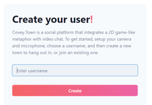
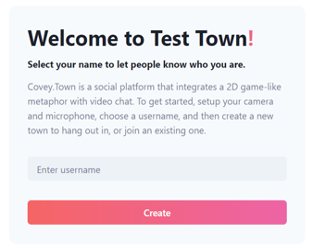
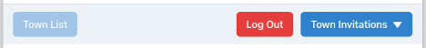
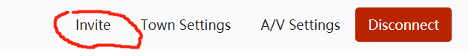

> This file  is from repository is from project [repository](https://github.com/imbaguanxin/covey.town.project.team23.git) of CS 5500, group 23. 
# Features
group 23

## Feature Introduction

The base version of Covey.Town lacks an invitation system that allows users to both invite and accept invitations from their friends. To increase the interactivity between users, we added such a system. To invite a user, a user can direct the invite tab at the bottom of the app. Under this tab, he/she can either click the invite button next to his/her friend or copy the invitation link and send it to the friend via social media. On the one hand, to accept invitations for a user currently on the town list page (the user has already created a username), he/she can view all invitations sent by others from the town invitation box and choose to accept or deny any invitation. On the other hand, for a user who hasn't created a username, he/she can use an invitation link to join the Covey.Town: the link will direct him/her to a page asking for a username and display the town name that he/she is entering.

##  Table of Contents
  
  
- [Features](#Features )
  - [Table of Contents](#table-of-contents )
  - [Feature Introduction](#Feature-Introduction )

## Identifier of a user: username

Since the invitation system needs something to keep track of user identification, we will always ask for a username before a user enters a town.

### The first page of the app:

### The landing page when user use a invitation link to join:

## Navigation Bar:

Once the user logged in with a username, he/she will see a navigation bar at the top of the page.

1.	Town List Button: This button is unclickable unless a user has already joined a town. Clicking this button will make the user quit the room and navigate him/her to the town list page.
2.	Logout Button: If a user clicks this button, he/she will go back to the first page of the app, which is the page asking for a username. He/she will no longer be visible to other users that are already in a town.
3.	Town Invitations Dropdown: A user can view all invitations and choose to accept or deny any of them in this dropdown menu.

### Navigation Bar:

Inviting Users:
After a user joins a town, he/she will see an invite button at the bottom right of the app page:

